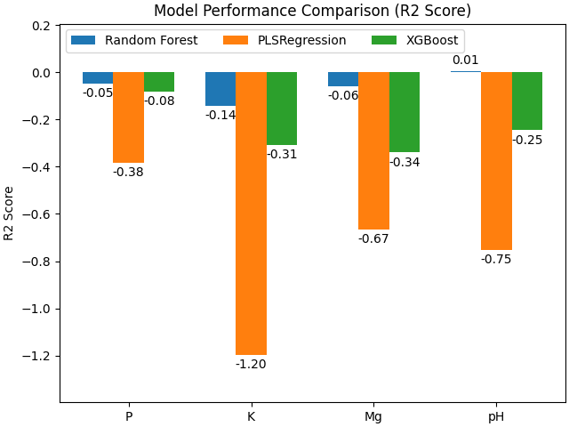
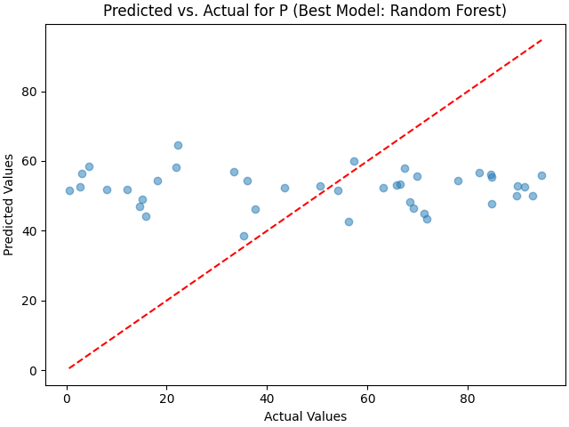
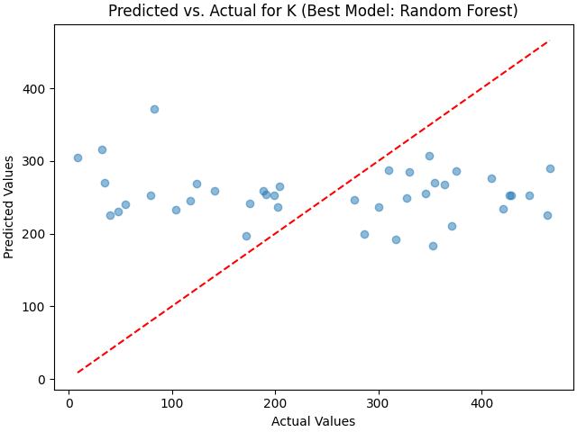
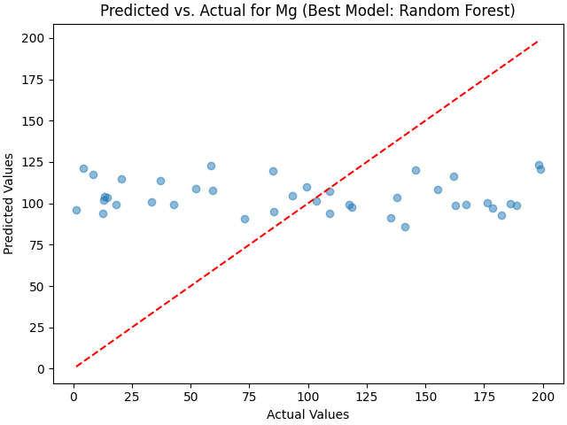
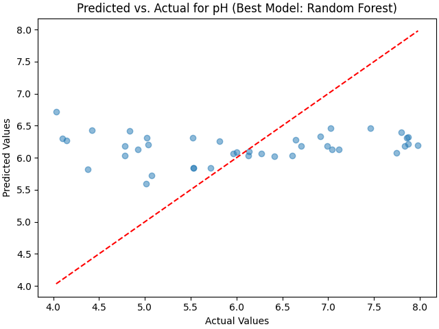

# Soil Quality Assessment using Hyperspectral Imaging

This repository contains the implementation of a project for a capstone review, aiming to assess soil quality using hyperspectral imaging. The project involves preprocessing hyperspectral data, training several machine learning models to predict soil nutrient levels, and calculating a Soil Quality Index (SQI).

## Project Overview

The goal of this project is to build a model that can predict the levels of key soil nutrients (Phosphorus, Potassium, Magnesium, and pH) from hyperspectral images. The project also includes a method for calculating a Soil Quality Index (SQI) based on the predicted nutrient levels.

## Methodology

### 1. Data Preprocessing

The hyperspectral data is preprocessed using the following steps:
1.  **Savitzky-Golay Smoothing:** To reduce noise in the spectral data.
2.  **Standard Normal Variate (SNV):** To correct for scatter effects.
3.  **Multiplicative Scatter Correction (MSC):** To further correct for scatter effects.
4.  **Spatial Averaging:** The 11x11 spatial dimensions of the hyperspectral cubes are averaged to produce a single spectrum per sample.

### 2. Machine Learning Models

Three different machine learning models are trained and evaluated for each nutrient:
*   **Random Forest Regressor**
*   **Partial Least Squares (PLS) Regression**
*   **XGBoost Regressor**

The models are trained on the preprocessed hyperspectral data to predict the nutrient levels. The performance of the models is evaluated using the R-squared (R2) score.

### 3. Soil Quality Index (SQI)

A Soil Quality Index (SQI) is calculated as a weighted average of the normalized predicted nutrient values. The SQI provides a single score to represent the overall soil quality. In this implementation, equal weights are used for all nutrients.

## Results

The models were trained on a mock dataset, and the following results were obtained.

### Model Performance Comparison

The following chart compares the R2 scores of the different models for each nutrient.



### Predicted vs. Actual Values

The following plots show the predicted vs. actual values for the best performing model for each nutrient.

| Phosphorus (P) | Potassium (K) |
| :---: | :---: |
|  |  |

| Magnesium (Mg) | pH |
| :---: | :---: |
|  |  |

## How to Run the Code

1.  **Install the required libraries:**
    ```bash
    pip install numpy scipy scikit-learn xgboost matplotlib
    ```
2.  **Run the `baseline_model.py` script:**
    ```bash
    python baseline_model.py
    ```
3.  **Run the `create_visualizations.py` script to generate the visualizations:**
    ```bash
    python create_visualizations.py
    ```